# Label Designer Framework — Arquitetura

> Status: **proposta para aprovação** — nenhum código de produção deve ser escrito antes deste documento (e do [ROADMAP.md](./ROADMAP.md)) serem validados.

## Índice

1. [Visão geral e objetivos](#1-visão-geral-e-objetivos)
2. [Desvios e adições em relação à lista original de packages](#2-desvios-e-adições-em-relação-à-lista-original-de-packages)
3. [Mapeamento em Clean Architecture](#3-mapeamento-em-clean-architecture)
4. [Estrutura de packages](#4-estrutura-de-packages)
5. [Diagrama de packages](#5-diagrama-de-packages)
6. [Diagrama de dependências](#6-diagrama-de-dependências)
7. [Responsabilidade de cada módulo](#7-responsabilidade-de-cada-módulo)
8. [Modelos de domínio (label_core)](#8-modelos-de-domínio-label_core)
9. [Layout Engine](#9-layout-engine)
10. [Sistema de expressões](#10-sistema-de-expressões)
11. [Renderers](#11-renderers)
12. [Formato de Template (.label)](#12-formato-de-template-label)
13. [Histórico (Command Pattern)](#13-histórico-command-pattern)
14. [Estado (MobX Stores)](#14-estado-mobx-stores)
15. [Canvas / Editor Visual](#15-canvas--editor-visual)
16. [Preview](#16-preview)
17. [Diagramas de sequência](#17-diagramas-de-sequência)
18. [Padrões de projeto aplicados](#18-padrões-de-projeto-aplicados)
19. [Estratégia de testes](#19-estratégia-de-testes)
20. [Integração no projeto existente do usuário](#20-integração-no-projeto-existente-do-usuário)
21. [Convenções de código e ferramentas](#21-convenções-de-código-e-ferramentas)

---

## 1. Visão geral e objetivos

Framework Flutter para criação, edição e impressão de etiquetas térmicas — um "Figma para etiquetas", desacoplado de qualquer impressora específica.

**Modelo de consumo**: este workspace produz **pacotes Dart/Flutter puros** (sem código nativo, não são "plugins" no sentido de platform channel), publicados via `path:`/`git:` (ou futuramente `pub.dev`). Não há aplicativo standalone entregável — o consumidor é o **projeto Flutter já existente do usuário**, que declara os pacotes necessários no seu `pubspec.yaml` (tipicamente `label_designer` para o editor visual e um ou mais `label_renderer_*` para impressão) e os utiliza como qualquer outra dependência. `apps/playground` existe só como ferramenta interna de desenvolvimento/teste deste workspace — não é código destinado ao usuário final.

Fluxo macro (imutável, é a espinha dorsal de todo o sistema):

```
Editor Visual → Template (.label) → LabelDocument → Layout Engine → Renderer → Comandos da Impressora
```

Regras inegociáveis que orientam toda decisão de arquitetura abaixo:

- `LabelDocument` não conhece impressoras, PPLA, ZPL ou TSPL.
- Todo cálculo de layout (posição, alinhamento, mm→dots, DPI, rotação, expressões) acontece **somente** no Layout Engine.
- Renderers só convertem um layout já resolvido (`ResolvedDocument`) para uma linguagem de saída. Nunca recalculam layout.
- O Editor Visual (`label_canvas`, `label_designer`) **nunca** importa nenhum `label_renderer_*`.
- O Preview usa exatamente o mesmo Layout Engine da impressão — a única diferença é o renderer final (`label_renderer_canvas` em vez de `label_renderer_argox`, por exemplo).

## 2. Desvios e adições em relação à lista original de packages

A lista de packages fornecida é o ponto de partida. Como arquiteto, proponho os seguintes acréscimos — cada um resolve uma responsabilidade que, se empurrada para um package existente, violaria responsabilidade única. Pedem aprovação explícita:

| Pacote proposto | Por que não cabe em outro lugar |
|---|---|
| `label_layout_engine` | A "Layout Engine" é uma camada inteira (camada 2 do enunciado). Colocá-la dentro de `label_core` misturaria *modelo de dados* com *lógica de resolução*; colocá-la em `label_renderer` violaria a regra "nenhum renderer recalcula layout". Vira package próprio, puro Dart. |
| `label_barcode` | Geração de símbolos de código de barras (matriz de bits / paths) é reaproveitada por `label_renderer_canvas`, `label_renderer_pdf` e futuramente por qualquer novo renderer. Sem esse pacote, cada renderer reimplementaria EAN13/QR/DataMatrix. |
| `label_designer_state` | Os MobX Stores (`DocumentStore`, `CanvasStore`, `SelectionStore`, `HistoryStore`, `PropertyStore`, `LayerStore`, `ViewportStore`) formam uma unidade coesa de orquestração de estado, consumida por `label_canvas`, `label_property_panel` e `label_designer`. Duplicar stores dentro de cada pacote de UI criaria dessincronia de estado. |
| `GroupElement` (modelo, não pacote) | Necessário para "Agrupar/Desagrupar" via padrão Composite — sem ele, agrupamento vira gambiarra de metadados soltos. |

Nenhum outro pacote da lista original foi removido ou renomeado.

## 3. Mapeamento em Clean Architecture

```
┌─────────────────────────────────────────────────────────────┐
│ Frameworks & Drivers (Flutter, I/O, apps)                    │
│  apps/*  label_designer  label_canvas  label_property_panel  │
│  label_widgets  label_preview                                │
├─────────────────────────────────────────────────────────────┤
│ Interface Adapters (traduzem domínio ↔ mundo externo)        │
│  label_renderer + label_renderer_argox/zebra/tsc/pdf/canvas  │
│  label_barcode  label_serialization                          │
├─────────────────────────────────────────────────────────────┤
│ Application / Use Cases (orquestração, sem UI, sem I/O)      │
│  label_history  label_designer_state                         │
├─────────────────────────────────────────────────────────────┤
│ Domain (entidades e regras puras, zero dependência Flutter)  │
│  label_core  label_expression_engine  label_layout_engine    │
└─────────────────────────────────────────────────────────────┘
```

Regra de dependência: setas sempre apontam **para dentro**. Nenhum pacote de domínio importa Flutter. Nenhum pacote de domínio conhece um renderer.

## 4. Estrutura de packages

```text
label_designer_workspace/            # monorepo (melos)
├── melos.yaml
├── analysis_options.yaml
├── packages/
│   ├── label_core/                  # entidades, value objects, enums
│   ├── label_expression_engine/     # parser/avaliador de {{ }}
│   ├── label_layout_engine/         # resolve variáveis + calcula layout
│   ├── label_serialization/         # .label (JSON) <-> LabelDocument
│   ├── label_history/               # Command Pattern, Undo/Redo
│   ├── label_barcode/               # geração de símbolos de barcode/QR
│   ├── label_renderer/              # interface LabelRenderer + contratos
│   ├── label_renderer_argox/        # PPLA / PPLB
│   ├── label_renderer_zebra/        # ZPL II
│   ├── label_renderer_tsc/          # TSPL
│   ├── label_renderer_pdf/          # PDF vetorial
│   ├── label_renderer_canvas/       # PNG / JPEG (preview e export)
│   ├── label_widgets/               # UI kit reutilizável (sem lógica de negócio)
│   ├── label_designer_state/        # MobX Stores
│   ├── label_canvas/                # editor visual (CustomPainter)
│   ├── label_property_panel/        # painel de propriedades
│   ├── label_preview/               # widget de preview (usa layout+canvas renderer)
│   ├── label_designer/              # composição do editor completo
│   └── label_designer_kit/          # guarda-chuva: reexporta a API pública numa única dependência
└── apps/
    └── playground/                  # sandbox interno, apenas para testar engines/renderers durante o desenvolvimento — não é entregável
```

> Não há `designer_desktop`/`designer_web` neste workspace. O projeto Flutter existente do usuário é o "app" que consome os pacotes acima via `pubspec.yaml`.

> **Adição pós-etapa 17**: `label_designer_kit` não estava na lista original de packages — foi adicionado depois que o guia de integração (etapa 17) deixou claro que exigir 6-8 dependências `path:`/`git:` separadas do projeto consumidor era um atrito real. Ele só reexporta símbolos de pacotes já existentes (não contém lógica própria além do barrel file) e não muda nenhuma regra de dependência interna deste diagrama — ver seção 20 e `docs/INTEGRATION.md`.

## 5. Diagrama de packages

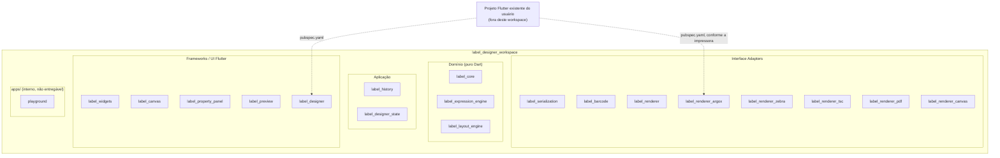

## 6. Diagrama de dependências

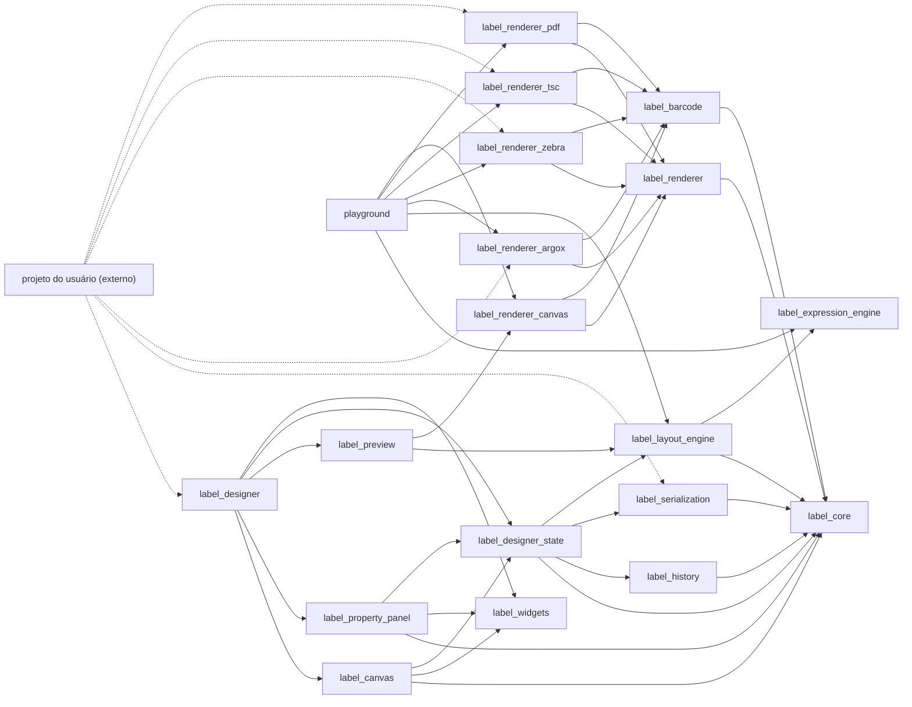

Observação de trade-off: `label_canvas` e `label_property_panel` dependem de `label_designer_state` (MobX) diretamente, por pragmatismo — ambos ficam reativos via `Observer()` sem camada extra. A alternativa mais pura (inversão de dependência, onde `label_canvas` define interfaces de controller e `label_designer_state` as implementa) fica documentada aqui como opção futura caso o projeto precise trocar MobX por outra solução de estado sem tocar no editor visual. Isso não viola a regra "editor nunca conhece renderer", pois `label_designer_state` não conhece nenhum `label_renderer_*`.

## 7. Responsabilidade de cada módulo

| Pacote | Responsabilidade única | Não faz |
|---|---|---|
| `label_core` | Entidades (`LabelDocument`, `LabelElement` e subtipos), value objects (`Point`, `Size2D`, `Dpi`, `Unit`), conversões de unidade puras | I/O, JSON, UI, layout, renderização |
| `label_expression_engine` | Tokenizar/parsear/avaliar `{{ expressão }}` contra um `Map<String,dynamic>` de dados | Não conhece `LabelDocument`, não sabe o que é mm ou dots |
| `label_layout_engine` | Resolver variáveis/expressões, calcular posição final, alinhamento, mm→dots, rotação, produzir `ResolvedDocument` | Não gera bytes de impressora, não desenha nada |
| `label_serialization` | `.label` (JSON) ⇄ `LabelDocument`, migração de versões | Não valida regras de negócio de layout |
| `label_history` | Command Pattern: `execute/undo/redo` sobre `LabelDocument` | Não sabe de MobX nem de UI |
| `label_barcode` | Gerar matriz/paths para EAN13, EAN8, Code39, Code128, UPC, ITF, Codabar, QRCode, PDF417, DataMatrix | Não desenha na tela, não conhece impressora |
| `label_renderer` | Contrato `LabelRenderer`, `RendererOptions`, `RenderResult` | Nenhuma implementação concreta |
| `label_renderer_argox` / `_zebra` / `_tsc` | Adaptar `ResolvedDocument` para PPLA/PPLB, ZPL II, TSPL | Não calcula layout |
| `label_renderer_pdf` | Adaptar `ResolvedDocument` para PDF vetorial | idem |
| `label_renderer_canvas` | Adaptar `ResolvedDocument` para PNG/JPEG (preview e export raster) | idem |
| `label_widgets` | Componentes visuais puros (color picker, réguas, ícones, botões) | Não conhece `LabelDocument` nem stores |
| `label_designer_state` | Stores MobX que orquestram documento, seleção, histórico, viewport, camadas, propriedades | Não desenha nada, não conhece renderer |
| `label_canvas` | Editor visual (drag, resize, rotate, snap, guides, seleção múltipla) via `CustomPainter` | Nunca importa `label_renderer_*` |
| `label_property_panel` | UI de edição de propriedades do elemento selecionado | Não calcula layout |
| `label_preview` | Renderiza preview usando `label_layout_engine` + `label_renderer_canvas` | Nunca usa renderer de impressora |
| `label_designer` | Composição do editor completo (toolbar, painéis, atalhos) | Não sabe salvar em disco nem imprimir (isso é do app) |
| *(projeto do usuário, externo a este workspace)* | Composition root real: abrir/salvar arquivo, escolher renderer, enviar bytes para a impressora | Não faz parte deste repositório |
| `playground` | Sandbox interno para testar engines/renderers isoladamente durante o desenvolvimento — não é entregável | — |

## 8. Modelos de domínio (label_core)

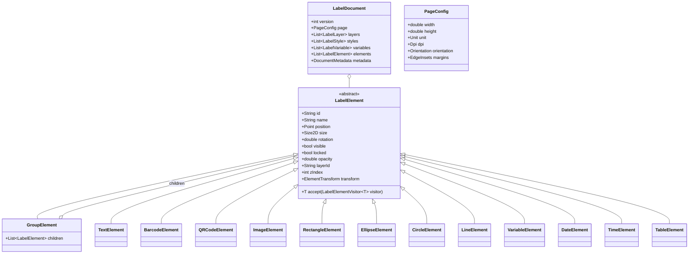

Notas de design:

- `LabelElement` é `sealed class` (Dart 3) — permite `switch` exaustivo em qualquer lugar que precise tratar cada tipo (Layout Engine, serialização, canvas), sem precisar de `is`/`as` espalhados.
- `accept(LabelElementVisitor visitor)` implementa **Visitor** para operações que variam por tipo (serializar, desenhar no canvas, resolver layout) sem poluir a entidade com lógica de infraestrutura.
- Todas as posições/tamanhos em `LabelElement` são em **milímetros** (`double`), nunca em pixels ou dots. Conversão só ocorre no Layout Engine.
- `GroupElement` implementa **Composite**, habilitando agrupar/desagrupar de forma recursiva (grupo dentro de grupo).
- `LabelStyle` permite estilos nomeados reutilizáveis (ex.: `"titulo"` → fonte, tamanho, cor) referenciados por `id` a partir de `TextElement.styleId`, evitando duplicação de estilo em cada elemento.
- `LabelVariable` declara `name`, `type` (`string`/`number`/`date`/`boolean`), `defaultValue`, `description` — usado pelo editor para autocompletar `{{ }}` e pela Layout Engine para validar dados recebidos na impressão.

## 9. Layout Engine

Única camada que conhece: variáveis, expressões, milímetros, DPI, dots, alinhamento, rotação final.

Entrada: `LabelDocument` + `Map<String,dynamic> data`.
Saída: `ResolvedDocument` (definido em `label_core`, como contrato de dados — ver observação abaixo).

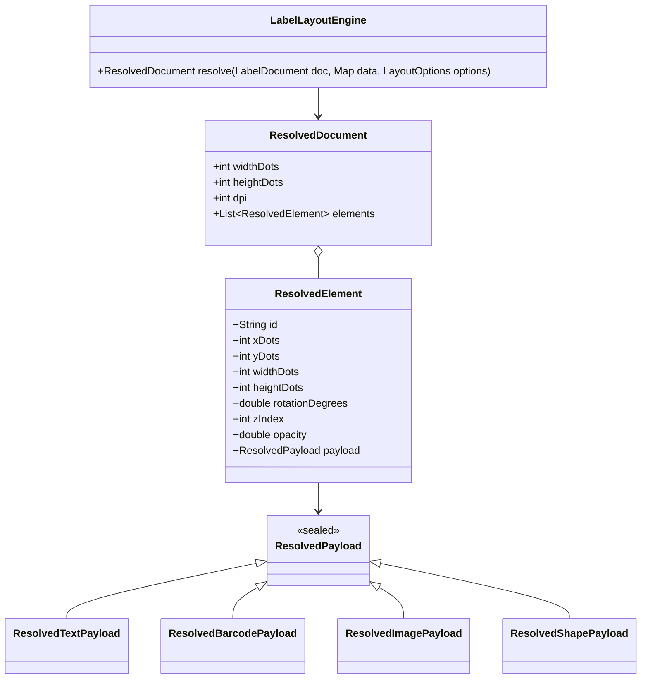

**Decisão importante**: `ResolvedDocument`/`ResolvedElement`/`ResolvedPayload` são definidos como *tipos de dados* dentro de `label_core` (não dentro de `label_layout_engine`). Isso permite que `label_renderer` e suas implementações dependam apenas de `label_core` — o contrato de dados — sem precisar depender do motor que o produz. É Dependency Inversion aplicado entre camadas: o pacote `label_layout_engine` depende de `label_core` para *produzir* o tipo; os renderers dependem de `label_core` para *consumir* o tipo. Nenhum dos dois depende do outro.

O diagrama acima é ilustrativo, não exaustivo — a implementação real (Etapa 4) tem 5 subtipos de `ResolvedPayload`, não 4: `ResolvedQrCodePayload` existe separado de `ResolvedBarcodePayload` porque `QRCodeElement` tem campos genuinamente diferentes (`errorCorrectionLevel` em vez de `symbology`/`showText`). Além disso, `ResolvedTextPayload.style` e `ResolvedShapePayload.style` usam `ResolvedTextStyle`/`ResolvedShapeStyle` — não `TextStyleSpec`/`ShapeStyleSpec` (os tipos de edição, em milímetros) — justamente para que o compilador impeça um renderer de receber `fontSize`/`strokeWidth` em mm por engano.

Responsabilidades detalhadas:

- Resolver `{{ variavel }}` e expressões via `label_expression_engine`.
- Resolver referências de estilo (`styleId` → propriedades concretas).
- Converter mm → dots usando o `Dpi` da página (203/300/600).
- Calcular posição absoluta final considerando rotação do elemento e, se aplicável, do grupo pai.
- Aplicar alinhamento (quando o elemento pertence a um container/guia de alinhamento).
- Expandir `GroupElement` recursivamente em elementos resolvidos "achatados", preservando z-index relativo.
- Validar dimensões mínimas (ex.: barcode não pode ter altura resolvida ≤ 0) — erros de layout são reportados como `LayoutException`, nunca silenciados.

## 10. Sistema de expressões

Pacote `label_expression_engine`, 100% Dart puro, zero dependência de `label_core`.

Pipeline: `String → Tokenizer → Parser (AST) → Evaluator`.

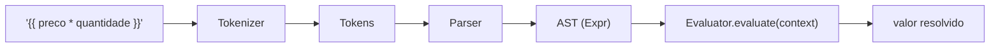

- Suporta: acesso a propriedade (`produto.nome`), operadores aritméticos, comparação, ternário, chamadas de método fluentes (`.format()`, `.currency()`).
- Funções de formatação (`format`, `currency`) são registradas via **Strategy**: um `Map<String, ExpressionFunction>` injetável, permitindo adicionar funções sem alterar o parser.
- O `Evaluator` nunca lança exceção não tratada para o chamador: erros de avaliação retornam um `ExpressionResult` (sucesso/erro) — quem decide o que fazer com um erro (mostrar `#ERROR#`, string vazia, etc.) é o Layout Engine, não o parser.
- Testável de forma isolada, sem precisar de `LabelDocument` nem Flutter.

## 11. Renderers

```dart
abstract class LabelRenderer {
  Future<Uint8List> render(
    ResolvedDocument document,
    RendererOptions options,
  );
}
```

> Nota: a assinatura do enunciado original recebe `LabelDocument document, Map<String,dynamic> data`. Nesta arquitetura o renderer recebe **`ResolvedDocument`** (já resolvido pelo Layout Engine) em vez de `LabelDocument` + `data` crus — é exatamente a regra "nenhum renderer recalcula layout" tornada explícita na assinatura. Quem chama `LayoutEngine.resolve(document, data)` antes de invocar `renderer.render(...)` é a camada de aplicação (`label_designer_state` ou o app). Peço validação explícita dessa mudança de assinatura, pois é a decisão mais importante do documento.

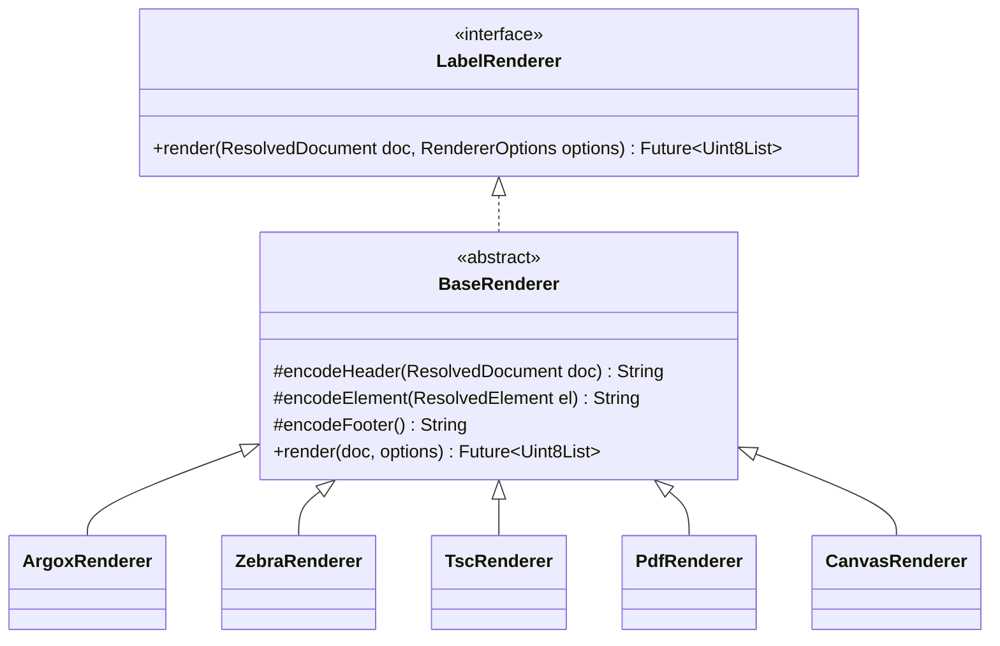

- `BaseRenderer` aplica **Template Method**: o fluxo `header → loop de elementos (Visitor sobre `ResolvedPayload`) → footer` é fixo; cada renderer concreto só implementa a codificação específica.
- Novo renderer (ex.: `BrotherRenderer`) = novo pacote `label_renderer_brother`, implementando `BaseRenderer`, sem tocar em nenhum pacote existente (**Open/Closed Principle**).
- `label_renderer_argox` cobre PPLA e PPLB como duas `RendererOptions.dialect` diferentes dentro do mesmo pacote (compartilham 90% da lógica Argox), evitando um pacote por dialeto.
- `RendererOptions` carrega parâmetros específicos do renderer (ex.: `darkness`, `speed`, `dialect`) sem contaminar `ResolvedDocument`.

> **Ajuste feito na Etapa 6**: `BaseRenderer` como um único Template Method de string (`header`/`encodeElement`/`footer` retornando `String`) faz sentido para os renderers de comando textual (Argox/Zebra/TSC, a serem implementados). Ele **não** se aplica a `CanvasRenderer`, que pinta em um canvas raster (`dart:ui`), não concatena strings — forçar a mesma forma abstrata seria uma abstração artificial. `label_renderer` continua com **apenas** a interface `LabelRenderer` (o contrato real, não-negociável); um `BaseRenderer` de Template Method específico para renderers baseados em comando textual será introduzido quando `label_renderer_argox` for implementado (etapa futura), sem afetar `CanvasRenderer`. `CanvasRenderer` implementa `LabelRenderer` diretamente, com seu próprio `switch` exaustivo sobre `ResolvedPayload` (sealed) para despachar a pintura por tipo — dispensa uma interface Visitor formal já que há um único consumidor.

## 12. Formato de Template (.label)

JSON versionado, extensão `.label`.

```json
{
  "version": 1,
  "name": "Etiqueta Produto",
  "page": {
    "width": 100,
    "height": 50,
    "unit": "mm",
    "dpi": 203,
    "orientation": "portrait",
    "margins": { "top": 2, "right": 2, "bottom": 2, "left": 2 }
  },
  "layers": [
    { "id": "layer-1", "name": "Base", "visible": true, "locked": false, "order": 0 }
  ],
  "styles": [
    { "id": "style-titulo", "fontFamily": "Roboto", "fontSize": 4, "bold": true }
  ],
  "variables": [
    { "name": "produto", "type": "string", "defaultValue": "" },
    { "name": "preco", "type": "number", "defaultValue": 0 }
  ],
  "elements": [
    {
      "id": "el-1",
      "type": "text",
      "position": { "x": 5, "y": 5 },
      "size": { "width": 40, "height": 8 },
      "rotation": 0,
      "visible": true,
      "locked": false,
      "opacity": 1,
      "layerId": "layer-1",
      "zIndex": 0,
      "content": "{{ produto }}",
      "styleId": "style-titulo"
    }
  ],
  "metadata": {
    "author": "carvalho.wesley@g3soft.com.br",
    "createdAt": "2026-07-02T00:00:00Z",
    "updatedAt": "2026-07-02T00:00:00Z",
    "history": [],
    "thumbnail": null
  }
}
```

- `label_serialization` implementa `LabelDocumentCodec` (encode/decode) e um pipeline de **migração versionada**: cada versão futura registra um `Migration(from: n, to: n+1)`; ao carregar um `.label` antigo, os migrations são aplicados em cadeia (**Chain of Responsibility**) até a versão atual, garantindo compatibilidade retroativa sem `if (version == ...)` espalhados.
- `metadata.thumbnail` guarda uma miniatura PNG em base64, gerada pelo `label_renderer_canvas` no momento do save.

## 13. Histórico (Command Pattern)

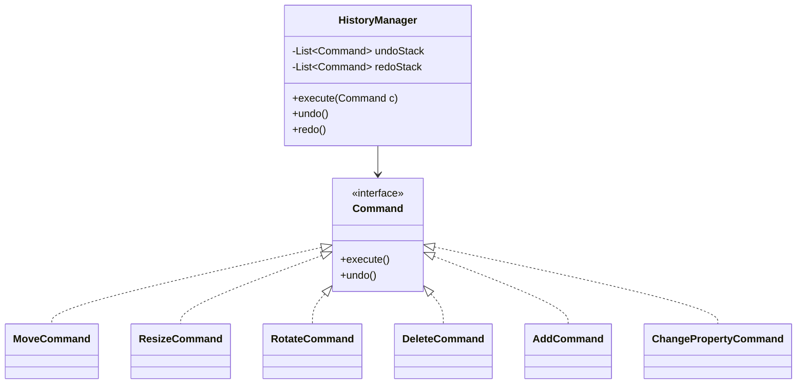

- `label_history` é puro Dart: opera sobre `LabelDocument` (imutável — cada `Command` produz uma nova versão do documento via `copyWith`, nunca muta em lugar) e não conhece MobX.
- `label_designer_state.HistoryStore` é uma camada fina que expõe `HistoryManager` reativamente para a UI.
- Comandos são serializáveis o suficiente para permitir, no futuro, colaboração/replay — não é escopo desta fase, mas a escolha de `Command` imutável mantém a porta aberta.

## 14. Estado (MobX Stores)

Pacote `label_designer_state`.

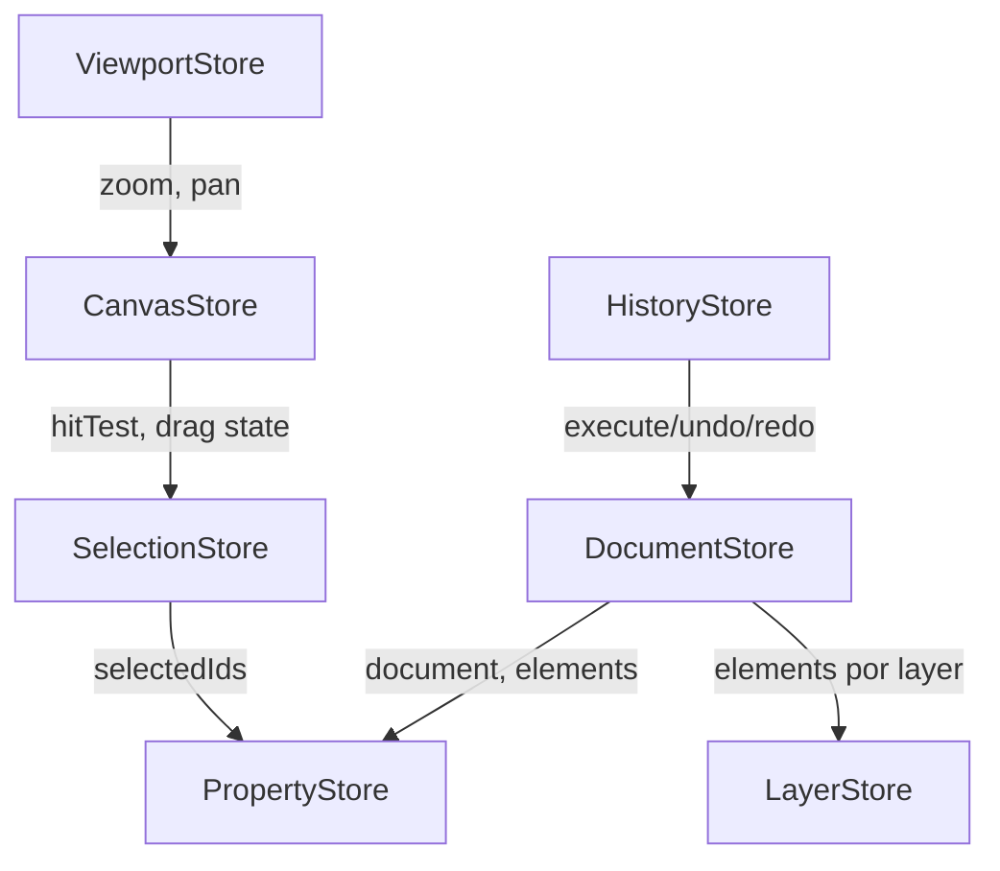

| Store | Responsabilidade |
|---|---|
| `DocumentStore` | Fonte da verdade do `LabelDocument` atual; expõe `@observable document` |
| `SelectionStore` | IDs selecionados, seleção múltipla, seleção de grupo |
| `HistoryStore` | Fachada reativa sobre `HistoryManager` (undo/redo, canUndo/canRedo) |
| `PropertyStore` | Deriva propriedades editáveis do(s) elemento(s) selecionado(s); despacha `ChangePropertyCommand` |
| `LayerStore` | Ordem, visibilidade e lock de camadas |
| `ViewportStore` | Zoom, pan, grid, snap, réguas |
| `CanvasStore` | Estado efêmero de interação (drag em andamento, handle de resize ativo, guides ativas) |

Cada store é uma classe MobX (`part 'x_store.g.dart'`), sem dependência de widgets — testável com `mobx` puro + `test`, sem `flutter_test`.

## 15. Canvas / Editor Visual

Pacote `label_canvas`, baseado em `CustomPainter` + `GestureDetector`/`Listener`.

Funcionalidades: zoom, pan, grid, snap, smart guides, réguas, seleção múltipla, resize (8 handles), rotação (handle dedicado), mover, bring-to-front/send-to-back, lock, hide, agrupar/desagrupar, copiar/colar/duplicar.

- `LabelCanvasPainter` (um `CustomPainter`) desenha a partir de `DocumentStore.document` + `ViewportStore` (transformação de mm → pixels de tela) + `SelectionStore` (bordas/handles de seleção). **Nunca** usa `label_layout_engine` nem qualquer renderer — o canvas desenha uma representação editável direta do modelo, com dados de exemplo (placeholders tipo `{{ produto }}` renderizados literalmente ou com dado de amostra configurável).
- Gestos traduzem-se em `Command`s (`MoveCommand`, `ResizeCommand`, ...) despachados via `HistoryStore.execute`, nunca mutam o documento diretamente — garante que toda ação do usuário é undo-ável por construção.
- Snap/Smart Guides são calculados no próprio `label_canvas` (é lógica de *edição*, não de *layout de impressão*) comparando bounding boxes em mm dos elementos visíveis.

## 16. Preview

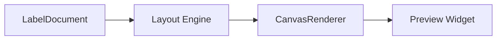

`label_preview` reage a mudanças em `DocumentStore` (debounced), chama `LabelLayoutEngine.resolve(document, sampleData)` e passa o `ResolvedDocument` para `label_renderer_canvas`, exibindo o PNG resultante via `Image.memory`. Isso garante, por construção, que o preview nunca diverge do resultado real de impressão — qualquer bug de layout aparece igual no preview e na etiqueta impressa.

## 17. Diagramas de sequência

### 17.1 Edição de propriedade (undo-ável)

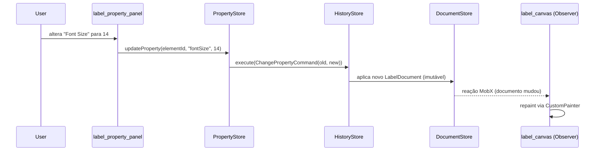

### 17.2 Impressão

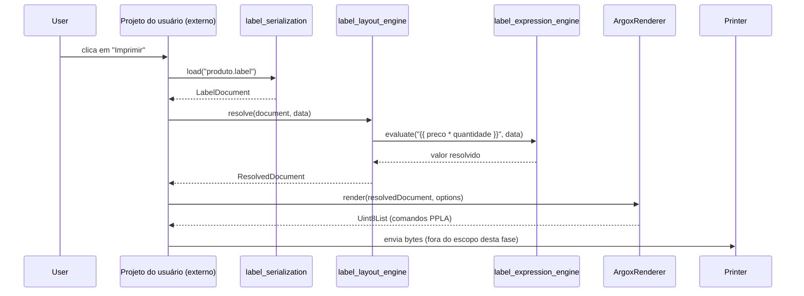

### 17.3 Preview em tempo real

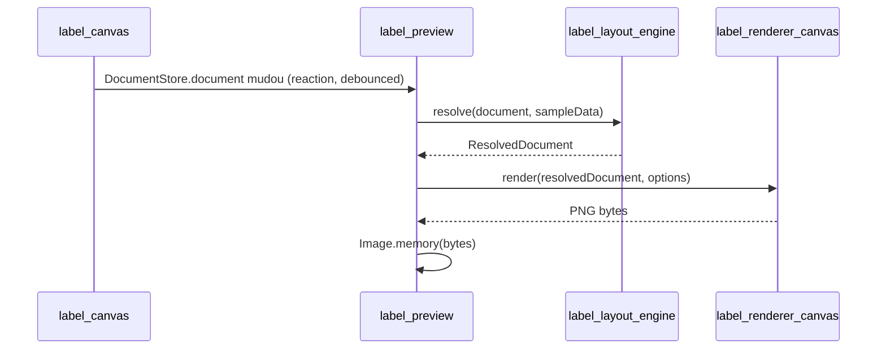

## 18. Padrões de projeto aplicados

| Padrão | Onde | Por quê |
|---|---|---|
| Composite | `GroupElement` sobre `LabelElement` | Agrupar/desagrupar recursivo |
| Visitor | `LabelElement.accept(visitor)` | Operações por tipo (desenhar, serializar, resolver) sem `is`/`as` |
| Strategy | Renderers (`LabelRenderer`), funções de expressão | Trocar algoritmo sem alterar quem chama |
| Template Method | `BaseRenderer` | Fluxo fixo header/elementos/footer, especialização mínima por impressora |
| Adapter | Cada `label_renderer_*` | Traduz `ResolvedDocument` para um protocolo externo específico |
| Command | `label_history` | Undo/redo, ações do canvas sempre reversíveis |
| Chain of Responsibility | Migrações de versão em `label_serialization` | Compatibilidade retroativa do `.label` sem `if` em cascata |
| Factory | `LabelElement.fromJson`, registro de renderers | Desacopla criação de tipo concreto |
| Observer | MobX (`@observable`/`Observer`) | Reatividade entre stores e widgets |
| Builder | Criação programática de `LabelDocument` em testes/playground | Construção fluente sem construtor telescópico |
| Dependency Inversion | `ResolvedDocument` em `label_core`, consumido por renderers | Renderers não dependem do motor de layout |

## 19. Estratégia de testes

| Pacote | Tipo de teste |
|---|---|
| `label_core` | Unit (puro Dart) — value objects, conversão de unidades |
| `label_expression_engine` | Unit — tokenizer/parser/evaluator, casos de erro |
| `label_layout_engine` | Unit — resolução de variáveis, mm→dots, rotação, grupos |
| `label_serialization` | Unit — round-trip encode/decode, migração de versões |
| `label_history` | Unit — execute/undo/redo, pilhas |
| `label_barcode` | Unit — encodings conhecidos comparados a fixtures |
| `label_renderer_*` | Golden/snapshot — bytes de saída comparados a fixtures gravadas |
| `label_designer_state` | Unit — reações MobX, sem Flutter |
| `label_canvas`, `label_property_panel`, `label_preview`, `label_designer` | Widget tests (`flutter_test`) |
| `apps/playground` | Integration tests manuais/E2E internos, guiados no ROADMAP por etapa |

## 20. Integração no projeto existente do usuário

Não há app entregável neste workspace — a integração acontece inteiramente via `pubspec.yaml` do projeto consumidor. Forma recomendada: uma única dependência em `label_designer_kit`, que reexporta tudo que o consumidor típico precisa (path dependency durante o desenvolvimento; git ou pub.dev depois de publicado):

```yaml
# pubspec.yaml do projeto do usuário
dependencies:
  label_designer_kit:
    path: ../label_designer_workspace/packages/label_designer_kit
```

Quem quiser controle fino (por exemplo, um serviço headless que só precisa de um renderer, sem o editor visual) pode continuar declarando os pacotes individuais em vez do guarda-chuva:

```yaml
dependencies:
  label_designer:
    path: ../label_designer_workspace/packages/label_designer
  label_renderer_argox:
    path: ../label_designer_workspace/packages/label_renderer_argox
  # + label_renderer_zebra, label_renderer_tsc, label_renderer_pdf conforme a impressora usada
```

Ver o passo a passo completo em [`docs/INTEGRATION.md`](./INTEGRATION.md).

Uso conceitual dentro de uma tela do projeto do usuário (ilustrativo — a API real será definida nas etapas 10-13 do roadmap):

```dart
// Tela de edição, dentro do app do usuário
LabelDesigner(
  document: meuLabelDocument,
  onSave: (doc) => salvarNoMeuBanco(doc),
)

// Na hora de imprimir, dentro do fluxo do app do usuário
final resolved = LabelLayoutEngine().resolve(document, dadosDoProduto);
final bytes = await ArgoxRenderer(dialect: ArgoxDialect.ppla).render(resolved, options);
await minhaImpressora.send(bytes); // transporte de impressão fica a cargo do projeto do usuário
```

O envio físico dos bytes para a impressora (USB/rede/Bluetooth) é responsabilidade do projeto do usuário — fora do escopo deste framework, que entrega os bytes já codificados na linguagem da impressora.

## 21. Convenções de código e ferramentas

- Monorepo gerenciado por **melos**.
- `analysis_options.yaml` único na raiz, com lints estritos (`very_good_analysis` ou equivalente), compartilhado por todos os pacotes.
- Dart 3 (`sealed class`, pattern matching) em todo o domínio.
- Nenhum pacote de domínio (`label_core`, `label_expression_engine`, `label_layout_engine`, `label_history`, `label_serialization`, `label_barcode`) importa `package:flutter`.
- Sem arquivos "deus": qualquer classe que ultrapasse ~300 linhas é candidata a ser dividida antes de seguir para a próxima etapa do roadmap.
- Pacotes que importam `package:flutter` (ex.: `label_renderer_canvas`, e futuramente `label_canvas`/`label_widgets`/`label_property_panel`/`label_preview`/`label_designer`) são testados com `flutter test`, não `dart test` — use `melos run test` para os pacotes Dart puro e `melos run test:flutter` para os pacotes Flutter.

---

Próximo documento: [ROADMAP.md](./ROADMAP.md) — como esta arquitetura será implementada de forma incremental, etapa por etapa, cada uma terminando funcional e testável.
